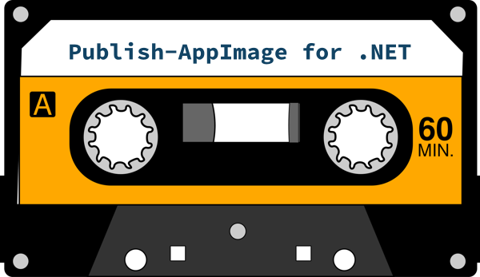
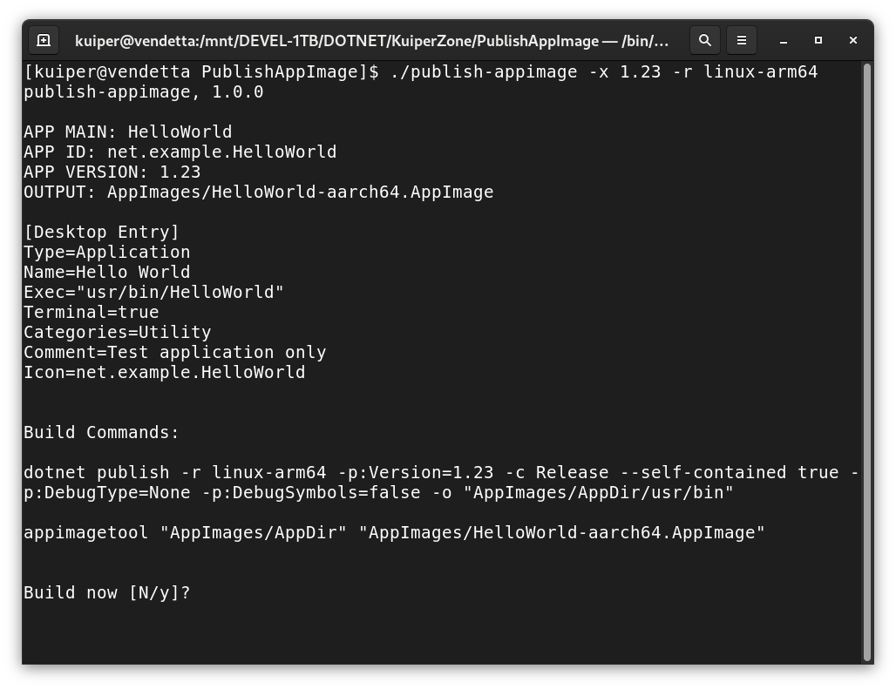

    

# Publish-AppImage for .NET #

**Publish-AppImage for .NET** is a simple bash script deployment utility which calls `dotnet publish` and
packages the output as an [AppImage](https://appimage.org/) file (or zip) with a single command. The Linux
"Desktop Entry" file is generated automagically.

It is licensed under MIT and is for use on Linux with the [Microsoft .NET SDK](https://dotnet.microsoft.com/download)
(i.e. for C# applications).

## Pre-requisits ##
Publish-AppImage for .NET requires (*):

* Bash shell
* .NET SDK 5.0 or later
* The [appimagetool](https://github.com/AppImage/AppImageKit) utility to build the AppImage file
* The Linux "zip" utility is optional and typically may already be installed on your system

(*) Tested bash 4.4.20 and appimagetool r13 (31 Dec 2020).

## Build HelloWorld ##
A simple "HelloWorld" terminal demo application is provided with the script.

**IMPORTANT:** Download and install [appimagetool](https://github.com/AppImage/AppImageKit). Ensure that `appimagetool`
is in the path, or you can specify its location in the .conf file if you have downloaded it as an AppImage file.

For example, in `publish-appimage.conf`, change this line:

    APPIMAGETOOL_COMMAND="appimagetool"

to this as appropriate:

    APPIMAGETOOL_COMMAND="/home/user/Apps/appimagetool-x86_64.AppImage"

The `publish-appimage` file itself is just a bash script so there is no need to "build" it, but ensure that it
has the executable flag set. From the top-level project directory, simply type:

    ./publish-appimage

This will call `dot publish` and create the output local to the .conf file, i.e.: *AppImages/HelloWorld-x86_64.AppImage*

Run `AppImages/HelloWorld-x86_64.AppImage` from a terminal, and it will output version and location information
available to application. That's all it does!

## Use in Your Project ##
There are only two files you really need. Drop the files, below, into your application source preferably at the
same level as your solution (.sln) or project (.csproj) file (*).

* `publish-appimage` - the utility
* `publish-appimage.conf` - your project config

Alternatively, if you wish, you may put the `publish-appimage` script in any directory on your system and add
the directory to the `PATH`. This way, only the ".conf file" need go into your project.

(*) If you do not wish to put `publish-appimage.conf` in the same directory as your .sln or .csproj, you can
specify the location with `DOTNET_PROJECT_PATH` in the .conf file.

**Note**, by default, `publish-appimage` will look for a file called `publish-appimage.conf` in the current
working directly. It is possible to have multiple .conf file -- see below. All project related paths in the .conf file
itself are relative to the location of the .conf file, and not from where command was called.

**IMPORTANT**: Edit the configuration file for your application, providing an application name etc. This should be a
relatively trivial matter and **all parameters are documented** with comments. You can specify application
"Desktop Entry" fields here, as well as publish/build arguments, and project and output locations.

If you wish to use an `appdata.xml`, copy the "Hello World" `appdata.xml` file and use it as a template in your project,
changing or adding properties to suit. Ensure that your `publish-appimage.conf` references the file location using
`APP_XML_SRC`. If you do not wish to use `appdata.xml`, ensure that `APP_XML_SRC` is unset.

An icon may also optionally be included in the AppImage. Ensure that your `publish-appimage.conf` references the
file location using `APP_ICON_SRC`.

## App Versioning ##
Use the `APP_VERSION` parameter in the .conf file to specify your application version, i.e. "1.2.3.0".

This will call publish with the `-p:Version` option and set the `VERSION` environment variable for use by
appimagetool. In the .conf file, you may optionally version the output package filename with `PKG_VERSION_FLAG`.

## Post Publish Command ##
The configuration contains an option called `POST_PUBLISH`. This may contain one or more commands, or point
to a script file. It is called after `dotnet publish`, but before the final AppImage output. You can use
to create require directory structures under `AppDir` or copy additional files there.

See also "Non-.NET Projects", below.

## Command Line Usage ##

### Target Platform ###
By default, publish-appimage will build for "linux-x64". However, you can specify the dotnet "runtime identifier" as:

    ./publish-appimage -r linux-arm64

For information, see: https://docs.microsoft.com/en-us/dotnet/core/rid-catalog

### Conf Filename ###
By default, `publish-appimage` looks for a single file called `publish-appimage.conf`. However, your
application project may contain multiple .conf files, but you must specify the configuration to use at
the command line, like so:

    ./publish-appimage -f other-file.conf

### Zip and Windows? ###
Amazingly, it is possible to build for Windows on a Linux box, although the binary is not suitable for use with
the AppImage format. However, you can do this instead:

    ./publish-appimage -r win-x64 -k zip

This will create a simple zip file of the published content instead of an AppImage file.

### All Options ###
    Usage:
        publish-appimage [-flags] [-option-n value-n]

    Help Options:
        -h, --help
        Show help information flag.

        -v, --version
        Show version information flag.

    Build Options:
        -f, --conf value
        Specifies the conf file. Defaults to publish-appimage.conf.

        -r, --runtime value
        Dotnet publish runtime identifier. Valid examples include:
        linux-x64 and linux-arm64. Default is linux-x64 if unspecified.
        See also: https://docs.microsoft.com/en-us/dotnet/core/rid-catalog

        -k, --kind value
        Package output kind. Value must be one of: appimage or zip.
        Default is appimage if unspecified.

        -b, --verbose
        Verbose review info output flag.

        -u, --run
        Run the application after successful build flag.

        -y, --skip-yes
        Skip confirmation prompt flag (assumes yes).

## Additional Information ##
Publish-AppImage for .NET was created by Andy Thomas at https://kuiper.zone

See also my other C# project, a cross-platform Avalonia XAML previewer called [AvantGarde](https://github.com/kuiperzone/AvantGarde).

### Gotcha - symlink ###
If you are using VirtualBox with your project within a shared folder, note that symbolic links are disabled within
shared folders by VirtualBox, and this will prevent `appimagetool` from working. To overcome this, copy
your entire project to your home directory in the virtual machine. Alternatively, it is possible to enable shared-folder
symlinks in VirtualBox.

### Non-.NET Projects? ###
It is also possible to use Publish-AppImage to build non-.NET projects (i.e. C++), although I don't imagine
this will be a primary use case. To do this, you must use a suitable build script and specify the file
location using the `POST_PUBLISH` config parameter. Your build script must populate the directory `AppDir/usr/bin`.

You should also set `DOTNET_PROJECT_PATH="null"` in order to disable the `dotnet publish` operation.

### Git Ignore? ###
You may wish to consider adding your output directory (i.e. "AppImages") to your gitignore file.

### Flatpak? ###
I initially intended that this utility spit out Flatpaks as well as AppImages. However, the configuration
and building of Flatpaks adds complexity. For the moment, I decided that this project was best served by
keeping things simple and elegant. I may do something on this a later, however.

Don't forget to like (star) and share this project (but only if *you do like it* of course).

